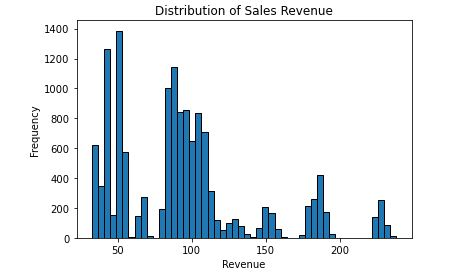
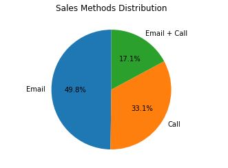
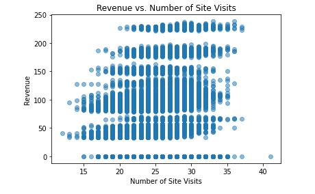
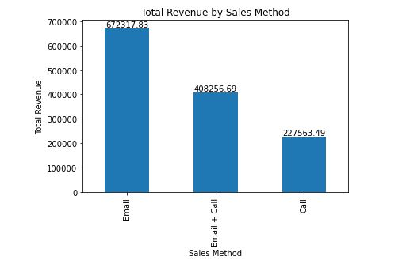

# **PAUL & PEARL SALES ANALYSIS**

## Introduction
This project focuses on analyzing sales data for a new line of office stationery launched by Paul & Pearl Inc., a trusted provider of office products. The goal is to identify effective sales strategies for the new product line and provide recommendations to improve sales performance.

## 📝 Project Objective

- Data validation:
  - Describe validation and cleaning steps for every column in the data 
- Exploratory Analysis:  
  - Include two different graphics showing single variables only to demonstrate the characteristics of data  
  - Include at least one graphic showing two or more variables to represent the relationship between features
  - Describe your findings
- Definition of a metric for the business to monitor  
  - How should the business use the metric to monitor the business problem
  - Can you estimate initial value(s) for the metric based on the current data
- Final summary including recommendations that the business should undertake

## 📝 Project Questions
- How many customers were there for each approach?
- What does the spread of the revenue look like overall? And for each method?
- Was there any difference in revenue over time for each of the methods?
- Based on the data, which method would you recommend we continue to use?

## 📝 Data and Analysis
The sales representative has provided data on the new product sales, including information on `sales methods`, `customer IDs`, the `number of products sold`, `revenue`, `customer tenure`, `website visits`, and `customer location`. The data will be processed and validated to ensure accuracy.

### **1.	DATA VALIDATION**
 

To ensure the accuracy and reliability of the data (product_sales), it is essential to validate and clean each column in the dataset. This involves reading the dataset, and all the columns in it, including their values, while checking for any inconsistencies or errors in the data and taking appropriate measures to correct them. The data validation process is as detailed below:
1. `week` column: week column contains 15,000 entries (rows) with no null values, ranging from 1 - 6 weeks. The column is an _integer_ column.
2. `sales_method` column: it contains _objects_ characters (Email, Call, and Email+Call), with no null values. But it contains some inconsistent values. Example: the value **em + call** was replaced with **Email + Call**; and the column **email** was replaced with **Email**, to match the naming convention used in other entries.
3. `customer_id` column: the _object_ characters contained here are the unique identifier for the customer. The column is in other, with no null values.
4. `nb_sold` column: contains _integer_ values for number of new products sold. It contains no null value.
5. `revenue` column: this is an integer column that details revenue from sales. **NA** values observed (depicting null values) were subsequenty replaced with **0** to match the numerical data type used in other entries and fill the empyt cells.
6. `years_as_customer` column: is an _integer_ column, which details number of years customers has been buying from the company. However, two outliers were observed, **47 years** and **63 years**, they are considered outliers since the company has been in existence for only **38 years since 1984-2022**. So the outliers were replaced with **38 years** to make them align; as using the median value of 3 years will be very small, and removing the outliers will affect other columns in the analysis. (NB: the dataset is assumed to terminate at 2022).
7. `nb_site_visits` column: this is an _integer_ column, which ranges from **12 - 41 times** that the customer has visited our website in the last 6 months. It has no null values.
8. `state` column: this is an _object_ column that details the location of customers, where orders are shipped. It contains no null value.
9. Checked the number of rows and columns, and the dataset statistics for the inconsistencies.
10. Unique count of values in all the columns was done using scatter-plot to check all the numeric variables for data validation’s sake.

### **2. EXPLORATORY ANALYSIS**

### **2b. DESCRIPTION OF FINDINGS**
1.	The chart shows that most of the sales revenue falls within the lower revenue range, with a `peak around $100`, and the distribution is skewed to the right.
2.	The pie chart shows the distribution of sales methods used by customers. The majority of sales were made through the `Email method, which accounts for 49.8% of all sales`. The next most popular sales method is `Email+Call with 33.1%` of all sales, and finally `Call with 17.1%`. This information can be used by the business to adjust their sales strategy and prioritize resources accordingly.
3.	The bar chart shows the total revenue generated by each sales method. It is evident from the chart that the `Email method generated the highest revenue`, followed by the Email+Call method and the Call method generated the least revenue. This finding suggests that the Email method is the most effective in generating sales revenue for the business, and the company can potentially focus more on this sales method to increase revenue.
4.	The scatter plot of `revenue vs. number of site visits` shows a `positive correlation between these two variables`. As the number of site visits increases, there is generally a corresponding increase in revenue generated. This suggests that our online presence is effective in driving sales, and that we may want to focus on increasing our online marketing efforts to continue to grow revenue.

### **3a. How should the business use the metric to monitor the business problem?**
 

Based on the analysis above, the business should **monitor the total revenue** generated by each sales method to determine which method is most effective in generating revenue. The bar chart of the total revenue by sales method clearly shows that the **Email** sales method is the most effective in generating revenue, followed by the Email+Call sales method, while the Call sales method generates the least revenue. Therefore, the business should consider allocating more resources and effort to the "Email" and "Email+Calls" methods, while also exploring ways to improve the website sales method. Additionally, the scatter plot of revenue versus the number of site visits indicates that there is a positive correlation between these two variables, suggesting that increasing the number of site visits may lead to higher revenue. Therefore, the business should consider implementing strategies to increase website traffic, such as improving search engine optimization (SEO) or running targeted advertising campaigns. By monitoring these metrics and implementing strategies to improve them, the business can effectively address the problem of declining revenue and improve its overall performance.

### **3b. Estimating initial value(s) for the metric based on the current data**
 

Yes, we can estimate the initial value(s) for the metrics based on the current data. For example, we can calculate the total revenue generated from each sales method and use it as a baseline for monitoring future revenue generation. We can also calculate the average number of site visits and revenue generated per customer, which can be used to set benchmarks for future performance. These initial values can be used to track progress over time and identify areas where improvements can be made.

## 📝 4. **Recommendations for the Business**
1. Increase the focus on **Email** as a sales method: The sales method distribution pie chart showed that Call is the least used sales method, accounting for only 17.3% of total revenue.  The business can increase the focus on this sales method by training more sales representatives to use this method effectively and by promoting it to customers.
2. Enhance the website user experience: The scatter plot of revenue vs. number of site visits showed a positive correlation between the two variables. This suggests that **increasing the number of site visits can lead to an increase in revenue**. To achieve this, the business can enhance the website user experience by improving website design, speed, and navigation.
3. Encourage repeat business: The histogram of sales revenue showed that the majority of sales revenue is generated by a small percentage of customers. To increase sales revenue, the business can **encourage repeat business by offering loyalty rewards and incentives to customers** who have been buying from the company for a long time.
4. Consider expanding to new states: The bar chart of total revenue by state showed that some states, such as California and Texas, generate significantly higher revenue than others. The business can consider expanding to new states to increase its customer base and revenue.
